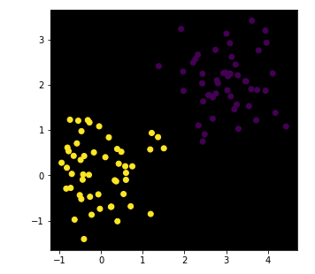

<h2>simple-neural-net</h2>

<i>
This repository contains Python notebook which contains creation of simple neural network. I have used synthesised 2 cluster dataset to train the network and test it. The network finally gives 90% accuracy.
  </i>

<h3>Dataset</h3>

<h3>Testing results</h3>

 
<h3>Developer</h3>

<i>Harsh Patel</i>
